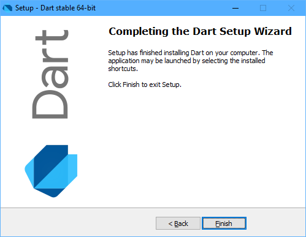

## 1.2 安装开发环境

Dart2有三大运行环境, 分布是Flutter, Web和Server. 其中Flutter框架自带了Dart语言, 可以用于开发跨平台的iOS和Android应用. 而Web则是通过内置的dart2js命令将Dart转译为JavaScript语言后在浏览器环境运行. Server的目标是使用Dart语言开发后段服务程序, 程序通过Dart虚拟机运行.

本书是以Dart编程语言为学习目标, 因此我们选择Server作为Dart的首选开发环境, 暂时忽略Flutter和Web环境. 其实Server和Web开发环境是一致的, 只不过是两个环境可使用的标准库和工具有些差异而已. 本节我们简单解释Dart服务器版本在macOS/Linux和Windows等系统的安装方式.

### 1.2.1 macOS环境

macOS环境推荐使用brew工具安装Dart:

```
$ brew tap dart-lang/dart
$ brew install dart
```

如果要安装开发版本, 可以传人一个`--devel`参数:

```
$ brew install dart --devel
```

如果已经通过brew安装过Dart语言了, 则可以通过以下命令升级到新版本的Dart:

```
$ brew upgrade dart
```

如果希望从开发分支切换回到稳定分支, 可以执行以下命令:

```
$ brew unlink dart
$ brew install dart
```

同样也可以从稳定分支强制切换到开发分支:

```
$ brew upgrade dart --devel --force
```

如果要在正式发布的版本之间切换, 则可以通过brew工具的switch子命令实现:

```
$ brew switch dart 1.24.3
$ brew switch dart 2.1.0
```

安装成功后可以通过`brew info`查看Dart版本:
```
$ brew info dart
dart-lang/dart/dart: stable 2.1.0, devel 2.2.0-dev.0.0
The Dart SDK
https://www.dartlang.org/
/usr/local/Cellar/dart/2.0.0-dev.55.0 (1,217 files, 295.7MB)
  Built from source on 2018-05-22 at 18:04:54
/usr/local/Cellar/dart/2.1.0 (339 files, 300.2MB) *
  Built from source on 2018-11-20 at 11:42:56
From: https://github.com/dart-lang/homebrew-dart/blob/master/dart.rb
==> Options
--devel
	Install development version 2.2.0-dev.0.0
==> Caveats
Please note the path to the Dart SDK:
  /usr/local/opt/dart/libexec
```


### 1.2.2 Linux环境

Linux环境通过`apt-get`工具安装Dart. 安装之前需要输入以下命令进行一次初始化工作:

```
$ sudo apt-get update
$ sudo apt-get install apt-transport-https
$ sudo sh -c 'curl https://dl-ssl.google.com/linux/linux_signing_key.pub | apt-key add -'
$ sudo sh -c 'curl https://storage.googleapis.com/download.dartlang.org/linux/debian/dart_stable.list > /etc/apt/sources.list.d/dart_stable.list'
```

然后通过以下命令安装Dart语言的稳定版本:

```
$ sudo apt-get update
$ sudo apt-get install dart
```

如果要安装开发版本则需要将安装源先切换到开发版本的环境:

```
$ sudo sh -c 'curl https://storage.googleapis.com/download.dartlang.org/linux/debian/dart_unstable.list > /etc/apt/sources.list.d/dart_unstable.list'
$ sudo apt-get update
$ sudo apt-get install dart
```

Dart的命令行工具最终被安装到了`/usr/lib/dart/bin`目录下, 用户需要将该路径添加到`PATH`环境变量之中. 此外, 用户也可以下载Debian安装包手工安装.

### 1.2.3 Windows环境

对于Windows用户推荐通过社区提供的“Dart SDK installer for Windows”离线安装包安装. 安装包可以从 http://www.gekorm.com/dart-windows/ 下载.



安装时可以选择安装稳定版本或者开发版本.

### 1.2.4 pub镜像服务

pub是Dart工具箱中最重要的工具, 它负责Dart包的全部管理工作. Dart的第三方包一般都是由 https://pub.dev/ 包服务管理. 中国大陆的Flutter中文社区和上海交通大学都为Dart官方的包服务提供了镜像服务. 可以通过`PUB_HOSTED_URL`环境变量告知pub命令从哪个服务下载包资源.

下面命令是设置从Flutter中文社区提供的镜像下载包:

```
export PUB_HOSTED_URL=https://pub.flutter-io.cn
```

或者是通过下面命令设置从上海交通大学的镜像服务下载包:

```
export PUB_HOSTED_URL=https://dart-pub.mirrors.sjtug.sjtu.edu.cn/
```

用户可以跟着自己的网络情况选择合适的镜像服务.

### 1.2.5 查看版本

Dart安装成功之后通过dart命令查看版本:

```
$ dart --version
Dart VM version: 2.1.0 (Tue Nov 13 18:22:02 2018 +0100) on "macos_x64"
```

上面的输出表示安装的是macOS系统的Dart 2.1稳定版本.

或者通过pub命令查看版本:

```
$ pub version
```
