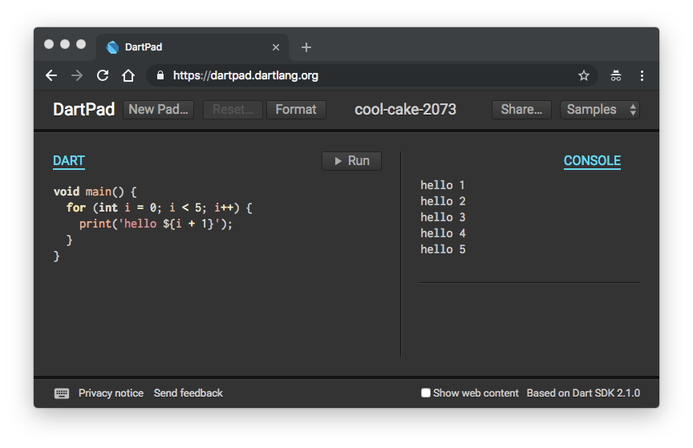

## 1.3 第一个Dart程序

我们以现已成为传统的“hello world”案例来开始吧, 这个例子首次出现于1978年出版的C语言圣经《The C Programming Language》. 这个例子虽然简单, 但是依然可以展示一些Dart语言的特性, 同时它可以用于检验Dart语言的开发环境是否正常工作.

### 1.3.1 hello world


创建hello.dart文件如下:

```dart
void main(List<String> args) {
    print ('hello ${args}');
}
```

Dart语言提供的dart命令可以直接运行Dart程序, 程序会从main函数开始执行:

```
$ dart hello.dart 世界
hello [世界]
```

在执行hello.dart程序时, 我们携带了一个额外的`世界`作为命令行参数, 因此输出了`hello [世界]`信息.

现在让我们简单解释下该程序. 首先Dart语言和C/C++/Java语言有着类似的函数语法, 默认从程序的main函数开始执行. 在找个例子中, main函数前面的void表示函数没有返回值. 同时main函数还有一个列表类型args参数变量, 用于表示执行程序时额外的命令行参数. 在main函数体内部, 通过内置的print函数输出字符串到标准输出并换行. 在输出字符串的内部, 程序通过`${args}`将args参数变量渲染为字符串后输出.

### 1.3.3 IDE集成开发环境

Dart官方为Android Studio/IntelliJ IDEA/Visual Studio Code等开发环境都提供了插件, 用户可以选择自己合适的IDE工具. 对于网络较好的并且新接触Dart语言的用户, 也可以通过Dart官方提供在线的DartPad开发环境测试小的Dart程序.

DartPad提供了语法高亮和代码格式化功能, 同时也提供了在线的运行功能. 下图是DartPad的效果图:



此外, 通过Github的gist发布的代码也可以在DartPad中直接运行. DartPad的具体细节请参考相关文档, 它的网址 https://dartpad.dartlang.org/


### 1.3.3 格式化代码

最后我们介绍下Dart内置的dartfmt程序格式化工具. 输入以下命令对hello.dart程序进行格式化:


```
$ dartfmt -w hello.dart
```

上述命令中`-w`参数表示将格式化后的成果写回文件. dartfmt不仅仅可以对Dart程序的源文件格式, 还可以对目录下所以的Dart程序进行代码格式化. 保持Dart程序符合标准的排版格式是一个很好的习惯.
