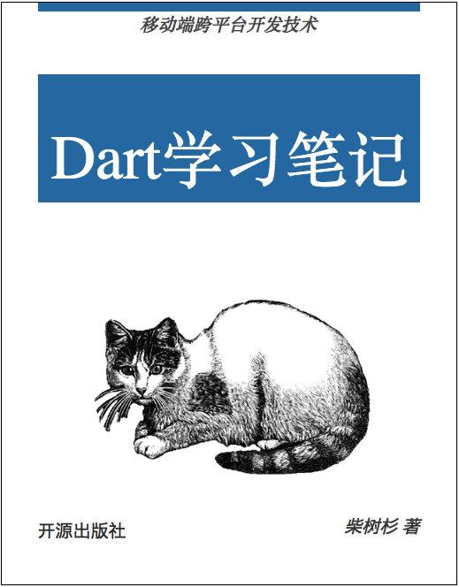

# Dart学习笔记

本书介绍了来自Google公司的Dart编程语言，它们是下一代移动端跨平台开发技术。

- 作者：柴树杉，Github [@chai2010](https://github.com/chai2010)，Twitter [@chaishushan](https://twitter.com/chaishushan)

## 在线阅读

- https://chai2010.cn/head-first-dart-book/

## 加入微信群

## 关注微信公众号(光谷码农/guanggu-coder)

## 版权声明

自有版权，转载请联系作者。

----

# 前言

TODO
